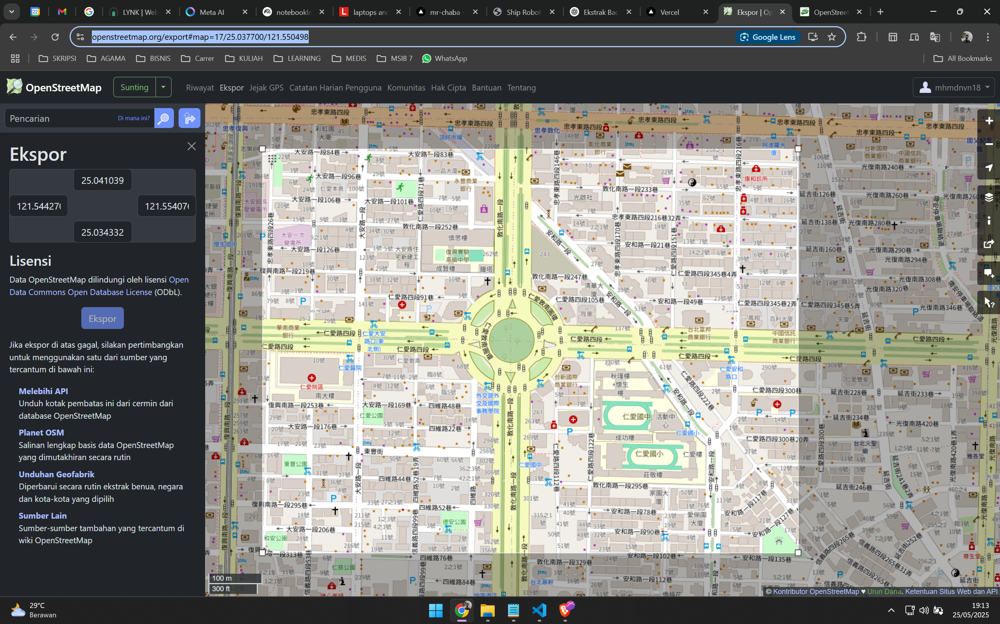
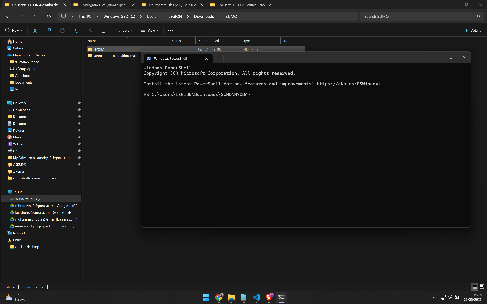
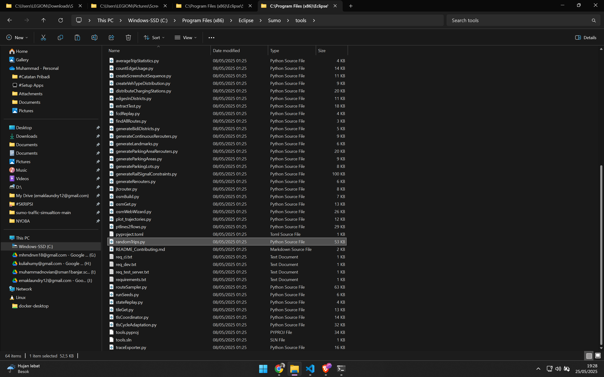

# Cara Membuat Network dan Simulasi Random Traffic pada SUMO

## 1. Ekspor Peta dari OpenStreetMap

- Buka [OpenStreetMap Export](https://www.openstreetmap.org/export#map=17/25.037700/121.550498)
- Pilih wilayah yang diinginkan, lalu ekspor sebagai `map.osm`.
- 

## 2. Siapkan File Proyek

- Simpan file `map.osm` ke folder proyek.
- Salin file `osmNetconvert.typ.xml` dari `C:\Program Files (x86)\Eclipse\Sumo\data\typemap` ke folder proyek.

## 3. Buka Terminal di Folder Proyek

- Klik kanan folder proyek, lalu pilih **Open in Terminal**.
- 

## 4. Konversi OSM ke Network SUMO

- Jalankan perintah berikut di terminal:
  ```
  netconvert --osm-files map.osm -o test.net.xml -t osmNetconvert.typ.xml --xml-validation never
  ```
- Akan muncul file baru bernama `test.net.xml`.

## 5. Buat File Typemap

- Buka [SUMO OSM Import Documentation](https://sumo.dlr.de/docs/Networks/Import/OpenStreetMap.html) untuk membuat file `typemap.xml`.
- 

## 6. Buat File Polygon

- Jalankan perintah berikut di terminal:
  ```
  polyconvert --net-file test.net.xml --osm-files map.osm --type-file typemap.xml -o map.poly.xml --xml-validation never
  ```

## 7. Salin Script Random Trips

- Salin file `randomTrips.py` dari `C:\Program Files (x86)\Eclipse\Sumo\tools` ke folder proyek.
- 

## 8. Generate Random Trips

- Jalankan perintah berikut di terminal:
  ```
  python randomTrips.py -n test.net.xml -r map.rou.xml -e 1000 -l --validate
  ```
- Akan muncul file baru bernama `trips.trips.xml`.

## 9. Buat File Konfigurasi SUMO

- Buat file bernama `map.sumocfg` dan isi dengan konfigurasi berikut:

  ```xml
  <?xml version="1.0" encoding="UTF-8"?>
  <!-- generated on 2024-06-12 18:31:58 by Eclipse SUMO sumo Version v1_20_0+0443-233e48e5c88 -->
  <sumoConfiguration xmlns:xsi="http://www.w3.org/2001/XMLSchema-instance" xsi:noNamespaceSchemaLocation="http://sumo.dlr.de/xsd/sumoConfiguration.xsd">
      <input>
          <net-file value="test.net.xml"/>
          <route-files value="trips.trips.xml"/>
          <additional-files value="map.poly.xml"/>
      </input>
      <time>
          <begin value="0"/>
          <end value="10000"/>
      </time>
  </sumoConfiguration>
  ```