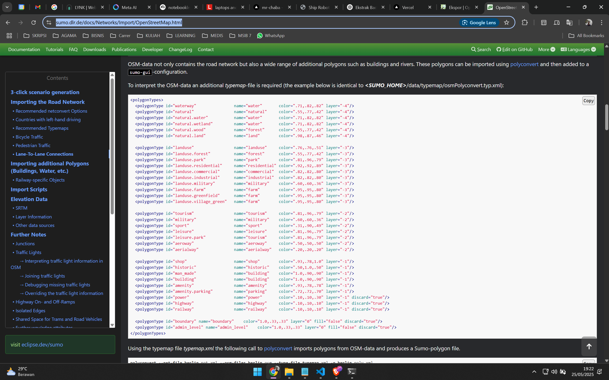

# SUMO Traffic Simulation Project

## Deskripsi

Proyek ini berisi file-file yang digunakan untuk melakukan simulasi lalu lintas menggunakan SUMO (Simulation of Urban MObility) dengan data peta dari OpenStreetMap (OSM). Simulasi ini dapat digunakan untuk menganalisis pergerakan kendaraan pada area tertentu berdasarkan data jaringan jalan yang diimpor dari OSM.

## Struktur File

- `map.osm` : Data peta hasil ekspor dari OpenStreetMap.
- `test.net.xml` : Jaringan jalan hasil konversi dari OSM ke format SUMO.
- `map.sumocfg` : File konfigurasi utama simulasi SUMO.
- `map.rou.xml` : File rute kendaraan (routes).
- `map.poly.xml` : File poligon (misal: bangunan, taman, air, dll).
- `typemap.xml` : Tipe poligon untuk visualisasi di SUMO.
- `osmNetconvert.typ.xml` : Tipe jaringan untuk konversi OSM ke SUMO.
- `randomTrips.py` : Skrip untuk menghasilkan perjalanan acak (random trips).
- `trips.trips.xml` : File hasil generate trip acak.
- `README.MD` : Dokumentasi dan petunjuk penggunaan.

## Cara Menggunakan

### 1. Persiapan Data

- Ekspor area peta dari [openstreetmap.org](https://www.openstreetmap.org/export) dan simpan sebagai `map.osm`.

### 2. Konversi OSM ke SUMO Network

Jalankan perintah berikut untuk mengkonversi file OSM ke jaringan SUMO:

```bash
netconvert --osm-files map.osm -o test.net.xml --type-files osmNetconvert.typ.xml
```

### 3. Generate Poligon (Opsional)

Jika ingin menampilkan bangunan, taman, dan fitur lain:

```bash
polyconvert --net-file test.net.xml --osm-files map.osm --type-file typemap.xml -o map.poly.xml
```

### 4. Generate Rute Kendaraan

Bisa menggunakan skrip randomTrips.py atau SUMO tools:

```bash
python randomTrips.py
# atau dengan sumo/tools/randomTrips.py
python <SUMO_TOOLS_PATH>/randomTrips.py -n test.net.xml -o trips.trips.xml
```

### 5. Jalankan Simulasi

Edit file `map.sumocfg` agar mengarah ke file network, route, dan poly yang sesuai.

Jalankan simulasi dengan SUMO GUI:

```bash
sumo-gui -c map.sumocfg
```

### 6. Visualisasi

SUMO GUI akan menampilkan simulasi lalu lintas sesuai konfigurasi.

## Referensi

- [SUMO Documentation](https://sumo.dlr.de/docs/)
- [Importing OSM Data](https://sumo.dlr.de/docs/Networks/Import/OpenStreetMap.html)
- [SUMO Tools](https://sumo.dlr.de/docs/Tools/)

---

**Catatan:**  
Pastikan semua file berada dalam satu folder kerja dan path file pada konfigurasi sudah benar.

# Cara Membuat Network dan Simulasi Random Traffic pada SUMO

## 1. Ekspor Peta dari OpenStreetMap

- Buka [OpenStreetMap Export](https://www.openstreetmap.org/export#map=17/25.037700/121.550498)
- Pilih wilayah yang diinginkan, lalu ekspor sebagai `map.osm`.
- 

## 2. Siapkan File Proyek

- Simpan file `map.osm` ke folder proyek.
- Salin file `osmNetconvert.typ.xml` dari `C:\Program Files (x86)\Eclipse\Sumo\data\typemap` ke folder proyek.

## 3. Buka Terminal di Folder Proyek

- Klik kanan folder proyek, lalu pilih **Open in Terminal**.
- 

## 4. Konversi OSM ke Network SUMO

- Jalankan perintah berikut di terminal:
  ```
  netconvert --osm-files map.osm -o test.net.xml -t osmNetconvert.typ.xml --xml-validation never
  ```
- Akan muncul file baru bernama `test.net.xml`.

## 5. Buat File Typemap

- Buka [SUMO OSM Import Documentation](https://sumo.dlr.de/docs/Networks/Import/OpenStreetMap.html) untuk membuat file `typemap.xml`.
- 

## 6. Buat File Polygon

- Jalankan perintah berikut di terminal:
  ```
  polyconvert --net-file test.net.xml --osm-files map.osm --type-file typemap.xml -o map.poly.xml --xml-validation never
  ```

## 7. Salin Script Random Trips

- Salin file `randomTrips.py` dari `C:\Program Files (x86)\Eclipse\Sumo\tools` ke folder proyek.
- 

## 8. Generate Random Trips

- Jalankan perintah berikut di terminal:
  ```
  python randomTrips.py -n test.net.xml -r map.rou.xml -e 1000 -l --validate
  ```
- Akan muncul file baru bernama `trips.trips.xml`.

## 9. Buat File Konfigurasi SUMO

- Buat file bernama `map.sumocfg` dan isi dengan konfigurasi berikut:

  ```xml
  <?xml version="1.0" encoding="UTF-8"?>
  <!-- generated on 2024-06-12 18:31:58 by Eclipse SUMO sumo Version v1_20_0+0443-233e48e5c88 -->
  <sumoConfiguration xmlns:xsi="http://www.w3.org/2001/XMLSchema-instance" xsi:noNamespaceSchemaLocation="http://sumo.dlr.de/xsd/sumoConfiguration.xsd">
      <input>
          <net-file value="test.net.xml"/>
          <route-files value="trips.trips.xml"/>
          <additional-files value="map.poly.xml"/>
      </input>
      <time>
          <begin value="0"/>
          <end value="10000"/>
      </time>
  </sumoConfiguration>
  ```