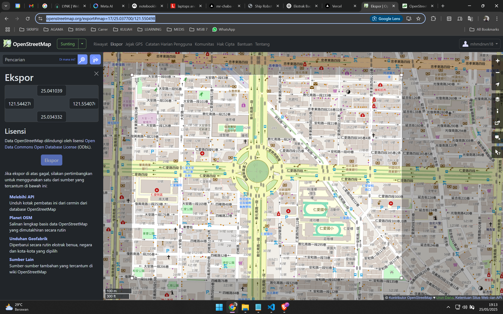
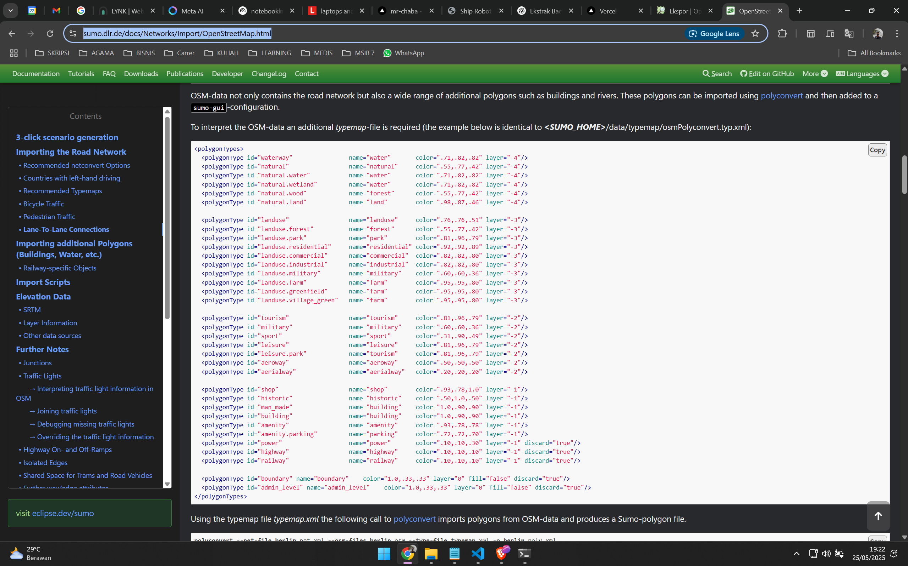
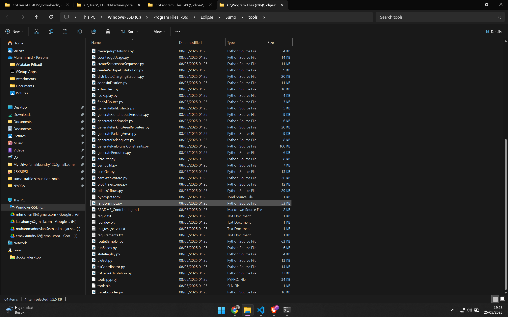

# SUMO Traffic Simulation

Simulasi lalu lintas menggunakan SUMO berbasis peta OSM, dengan lampu lalu lintas adaptif dan analisis hasil simulasi.

---

## Struktur File

- `map.sumocfg` : Konfigurasi utama simulasi
- `map.rou.xml` : Rute kendaraan
- `map.poly.xml` : Poligon peta
- `tripinfo.xml` : Output statistik perjalanan
- `adaptive_traffic_light.py` : Skrip lampu lalu lintas adaptif
- `analyze_tripinfo.py` : Analisis hasil simulasi
- `images/hasil_simulasi.png` : Visualisasi hasil analisis

---

## Cara Menjalankan

1. **Persiapan**
   - Pastikan SUMO dan Python sudah terpasang.
   - Pastikan file jaringan (`map.sumocfg` dan dependensinya) sudah tersedia.

2. **Jalankan Simulasi Lampu Lalu Lintas Adaptif**
   ```bash
   python adaptive_traffic_light.py
   ```
   - Akan menjalankan SUMO GUI dan menghasilkan file `tripinfo.xml`.

3. **Analisis Hasil Simulasi**
   ```bash
   python analyze_tripinfo.py
   ```
   - Akan menampilkan statistik rata-rata waktu tempuh dan tunggu.
   - Grafik hasil disimpan di folder `images/hasil_simulasi.png`.

---

## Catatan

- Jika tidak ada lampu lalu lintas, tambahkan terlebih dahulu menggunakan netedit SUMO.
- Output statistik dapat dilihat pada file `tripinfo.xml` dan visualisasi PNG.
- Folder `images` akan dibuat otomatis jika belum ada.

---

# SUMO Traffic Simulation Project

## Deskripsi

Proyek ini berisi file-file yang digunakan untuk melakukan simulasi lalu lintas menggunakan SUMO (Simulation of Urban MObility) dengan data peta dari OpenStreetMap (OSM). Simulasi ini dapat digunakan untuk menganalisis pergerakan kendaraan pada area tertentu berdasarkan data jaringan jalan yang diimpor dari OSM.

## Struktur File

- `map.osm` : Data peta hasil ekspor dari OpenStreetMap.
- `test.net.xml` : Jaringan jalan hasil konversi dari OSM ke format SUMO.
- `map.sumocfg` : File konfigurasi utama simulasi SUMO.
- `map.rou.xml` : File rute kendaraan (routes).
- `map.poly.xml` : File poligon (misal: bangunan, taman, air, dll).
- `typemap.xml` : Tipe poligon untuk visualisasi di SUMO.
- `osmNetconvert.typ.xml` : Tipe jaringan untuk konversi OSM ke SUMO.
- `randomTrips.py` : Skrip untuk menghasilkan perjalanan acak (random trips).
- `trips.trips.xml` : File hasil generate trip acak.
- `README.MD` : Dokumentasi dan petunjuk penggunaan.

## Cara Menggunakan

### 1. Persiapan Data

- Ekspor area peta dari [openstreetmap.org](https://www.openstreetmap.org/export) dan simpan sebagai `map.osm`.

### 2. Konversi OSM ke SUMO Network

Jalankan perintah berikut untuk mengkonversi file OSM ke jaringan SUMO:

```bash
netconvert --osm-files map.osm -o test.net.xml --type-files osmNetconvert.typ.xml
```

### 3. Generate Poligon (Opsional)

Jika ingin menampilkan bangunan, taman, dan fitur lain:

```bash
polyconvert --net-file test.net.xml --osm-files map.osm --type-file typemap.xml -o map.poly.xml
```

### 4. Generate Rute Kendaraan

Bisa menggunakan skrip randomTrips.py atau SUMO tools:

```bash
python randomTrips.py -n test.net.xml -o trips.trips.xml
```

### 5. Jalankan Simulasi

Edit file `map.sumocfg` agar mengarah ke file network, route, dan poly yang sesuai.

Jalankan simulasi dengan SUMO GUI:

```bash
sumo-gui -c map.sumocfg
```

### 6. Visualisasi

SUMO GUI akan menampilkan simulasi lalu lintas sesuai konfigurasi.

## Referensi

- [SUMO Documentation](https://sumo.dlr.de/docs/)
- [Importing OSM Data](https://sumo.dlr.de/docs/Networks/Import/OpenStreetMap.html)
- [SUMO Tools](https://sumo.dlr.de/docs/Tools/)
https://www.youtube.com/watch?v=NOPn9sE0AdY

---

**Catatan:**  
Pastikan semua file berada dalam satu folder kerja dan path file pada konfigurasi sudah benar.

# Cara Membuat Network dan Simulasi Random Traffic pada SUMO

## 1. Ekspor Peta dari OpenStreetMap

- Buka [OpenStreetMap Export](https://www.openstreetmap.org/export#map=17/25.037700/121.550498)
- Pilih wilayah yang diinginkan, lalu ekspor sebagai `map.osm`.
- 

## 2. Siapkan File Proyek

- Simpan file `map.osm` ke folder proyek.
- Salin file `osmNetconvert.typ.xml` dari `C:\Program Files (x86)\Eclipse\Sumo\data\typemap` ke folder proyek.

## 3. Buka Terminal di Folder Proyek

- Klik kanan folder proyek, lalu pilih **Open in Terminal**.
- 

## 4. Konversi OSM ke Network SUMO

- Jalankan perintah berikut di terminal:
  ```
  netconvert --osm-files map.osm -o test.net.xml -t osmNetconvert.typ.xml --xml-validation never
  ```
- Akan muncul file baru bernama `test.net.xml`.

## 5. Buat File Typemap

- Buka [SUMO OSM Import Documentation](https://sumo.dlr.de/docs/Networks/Import/OpenStreetMap.html) untuk membuat file `typemap.xml`.
- 

## 6. Buat File Polygon

- Jalankan perintah berikut di terminal:
  ```
  polyconvert --net-file test.net.xml --osm-files map.osm --type-file typemap.xml -o map.poly.xml --xml-validation never
  ```

## 7. Salin Script Random Trips

- Salin file `randomTrips.py` dari `C:\Program Files (x86)\Eclipse\Sumo\tools` ke folder proyek.
- 

## 8. Generate Random Trips

- Jalankan perintah berikut di terminal:
  ```
  python randomTrips.py -n test.net.xml -r map.rou.xml -e 1000 -l --validate
  ```
- Akan muncul file baru bernama `trips.trips.xml`.

## 9. Buat File Konfigurasi SUMO

- Buat file bernama `map.sumocfg` dan isi dengan konfigurasi berikut:

  ```xml
  <?xml version="1.0" encoding="UTF-8"?>
  <!-- generated on 2024-06-12 18:31:58 by Eclipse SUMO sumo Version v1_20_0+0443-233e48e5c88 -->
  <sumoConfiguration xmlns:xsi="http://www.w3.org/2001/XMLSchema-instance" xsi:noNamespaceSchemaLocation="http://sumo.dlr.de/xsd/sumoConfiguration.xsd">
      <input>
          <net-file value="test.net.xml"/>
          <route-files value="trips.trips.xml"/>
          <additional-files value="map.poly.xml"/>
      </input>
      <time>
          <begin value="0"/>
          <end value="10000"/>
      </time>
  </sumoConfiguration>
  ```

# Adaptive Traffic Light Simulation and Analysis in SUMO

## Deskripsi
Simulasi lampu lalu lintas adaptif berbasis IoT menggunakan SUMO & TraCI. Skrip Python mengontrol lampu lalu lintas secara real-time berdasarkan jumlah kendaraan, lalu menganalisis hasil perjalanan kendaraan dari file `tripinfo.xml`.

## Langkah-langkah Menjalankan Simulasi

1. **Siapkan Jaringan dan Rute**
   - Pastikan file jaringan (`map.sumocfg`, `test.net.xml`, dll) dan rute (`map.rou.xml` atau `trips.trips.xml`) sudah tersedia.
   - Jika belum ada lampu lalu lintas, tambahkan menggunakan Netedit.

2. **Jalankan Simulasi Lampu Adaptif**
   - Pastikan SUMO dan TraCI sudah terinstall.
   - Jalankan perintah berikut di terminal:
     ```
     python adaptive_traffic_light.py
     ```
   - Simulasi akan berjalan dan menghasilkan file `tripinfo.xml`.

3. **Analisis Hasil Simulasi**
   - Setelah simulasi selesai, jalankan:
     ```
     python analyze_tripinfo.py
     ```
   - Statistik rata-rata waktu tempuh dan waktu tunggu akan ditampilkan.
   - Grafik perbandingan otomatis disimpan sebagai `hasil_simulasi.png`.

## Penjelasan Skrip

- **adaptive_traffic_light.py**  
  Mengontrol lampu lalu lintas adaptif. Jika kendaraan di lajur banyak, durasi hijau diperpanjang. Jika sedikit, dipersingkat. TraCI digunakan untuk kontrol real-time.

- **analyze_tripinfo.py**  
  Membaca `tripinfo.xml`, menghitung rata-rata waktu tempuh dan tunggu, serta membuat grafik perbandingan.

## Studi Kasus & Tujuan
- **Masalah:** Kemacetan di simpang padat akibat lampu konvensional yang tidak adaptif.
- **Solusi:** Lampu adaptif berbasis deteksi kendaraan (IoT/IoV) memperpanjang hijau jika antrean panjang.
- **Eksperimen:** Bandingkan performa lampu tetap vs adaptif menggunakan metrik waktu tempuh dan tunggu rata-rata.

## File Penting
- `adaptive_traffic_light.py`
- `analyze_tripinfo.py`
- `tripinfo.xml`
- `hasil_simulasi.png`

## Catatan
- Pastikan dependensi Python (misal: `matplotlib`) sudah terinstall.
- File `tripinfo.xml` akan kosong jika simulasi belum dijalankan atau tidak ada kendaraan.

# Simulasi Lampu Lalu Lintas Adaptif (IoT) dengan SUMO & TraCI

## ▶️ Menjalankan Simulasi:
```bash
python adaptive_traffic_light.py
```

## 📊 Menjalankan Analisis Hasil:
```bash
python analyze_tripinfo.py
```
Akan muncul grafik dan nilai rata-rata waktu tempuh & waktu tunggu kendaraan.

## 1. Simulasi Lampu Lalu Lintas Adaptif

Skrip `adaptive_traffic_light.py` mengontrol lampu lalu lintas adaptif menggunakan TraCI. Jalankan SUMO GUI dengan konfigurasi berikut:

```bash
python adaptive_traffic_light.py
```

Skrip akan:
- Memulai SUMO GUI dengan file `map.sumocfg` dan output `tripinfo.xml`
- Mengecek apakah ada lampu lalu lintas di jaringan (jika tidak ada, tampilkan pesan)
- Setiap langkah simulasi, membaca jumlah kendaraan di tiap lajur masuk
- Jika jumlah kendaraan > 5, menambah durasi hijau pada fase saat ini
- Menutup koneksi setelah simulasi selesai

## 2. Analisis Hasil Simulasi

Setelah simulasi selesai, file `tripinfo.xml` berisi data perjalanan tiap kendaraan. Untuk menganalisis performa (rata-rata waktu tempuh dan tunggu), jalankan:

```bash
python analyze_tripinfo.py
```

Skrip akan:
- Membaca file `tripinfo.xml`
- Menghitung rata-rata waktu tempuh dan waktu tunggu seluruh kendaraan

## Catatan

- Pastikan jaringan (`test.net.xml`) sudah memiliki lampu lalu lintas (bisa diedit dengan Netedit).
- File output `tripinfo.xml` akan dihasilkan otomatis oleh SUMO.

# Troubleshooting & Perbaikan Simulasi SUMO

## Rangkuman Masalah Umum

| Masalah | Penyebab | Dampak |
|---------|----------|--------|
| Tidak ada lampu lalu lintas (TLS) | Belum ditambahkan ke jaringan di test.net.xml | Kendaraan tidak dikendalikan fase, atau macet di persimpangan |
| Rata-rata waktu tempuh sangat tinggi | Kendaraan tidak bergerak karena stuck | Rata-rata 6200 detik waktu tempuh & 5900 detik waktu tunggu |
| Jaringan terlalu kompleks/edge tidak nyambung | Banyak edge panjang/tidak tersambung | Kendaraan berputar/berhenti total |
| Terlalu banyak kendaraan | randomTrips.py menghasilkan >100 kendaraan | Kepadatan ekstrem, kemacetan parah |
| Durasi simulasi terlalu panjang | end=1000 terlalu lama | Tidak efisien saat debugging |

## Langkah Perbaikan

1. **Tambahkan Traffic Light (TLS)**
   - Buka `test.net.xml` di netedit.
   - Klik node persimpangan, pilih "Add Traffic Light".
   - Simpan ulang file.

2. **Ubah Jumlah Kendaraan**
   - Jalankan ulang randomTrips.py dengan:
     ```
     python randomTrips.py --number 20 --end 300
     ```
   - Ini mengurangi kepadatan.

3. **Uji Coba dengan Fixed Time**
   - Jalankan simulasi biasa di sumo-gui.
   - Pastikan kendaraan bergerak lancar sebelum mencoba adaptif.

4. **Batasi Durasi Simulasi**
   - Edit `map.sumocfg`, ubah:
     ```xml
     <end value="300"/>
     ```
   - Simulasi lebih singkat, mudah debug.

5. **Pastikan Edge Terhubung**
   - Buka jaringan di netedit.
   - Pastikan setiap edge punya jalur keluar (tidak buntu).

6. **Tambahkan Phase Durations**
   - Setelah TLS ditambahkan, atur fase (misal NS hijau 30 detik, EW hijau 30 detik).

## Peningkatan Disarankan

- Tambahkan 2 skenario: Fixed vs Adaptive.
- Gunakan matplotlib untuk membandingkan grafik bar fixed vs adaptive.
- Dokumentasikan ID TLS dan fase untuk logika Python lebih presisi.
- Buat file konfigurasi `.sumocfg` terpisah untuk tiap skenario.

## File yang Perlu Diperbarui/Diperiksa

| File                | Tindakan                                              |
|---------------------|------------------------------------------------------|
| test.net.xml        | Tambahkan lampu lalu lintas (netedit), simpan ulang   |
| randomTrips.py      | Jalankan ulang dengan --number 20                     |
| map.sumocfg         | Tambahkan tripinfo.xml, ubah <end> ke 300             |
| adaptive_traffic_light.py | Pastikan TLS tersedia di jaringan               |
| tripinfo.xml        | Akan berubah setelah simulasi diperbaiki              |

## Menambahkan Kendaraan IoT-enabled (Connected Vehicles):

Konsep: Dalam SUMO, “IoT-enabled” dapat direpresentasikan dengan menambahkan kendaraan yang dilengkapi sensor (misal: kemampuan deteksi kepadatan), yang data-nya nantinya dipakai TraCI.

Namun untuk saat ini, cukup definisikan tipe kendaraan biasa di SUMO, karena nanti kita akan memanipulasi melalui TraCI.

Contoh definisi tipe kendaraan di file rute (.rou.xml):

```xml
<vType id="iot_car" vClass="car" color="1,0,0" accel="2.0" decel="4.5" length="5.0" minGap="2.5" />
```

Pastikan kita punya minimal beberapa kendaraan (setidaknya 3–5 unit) yang nantinya akan terhubung ke pengaturan lampu melalui TraCI.

---

# SUMO Traffic Simulation

## Penjelasan File Simulasi

Berikut adalah perbedaan dan urutan penggunaan file simulasi utama:

### 0.randomTrips.py
Digunakan untuk menghasilkan file perjalanan/rute acak (trips) yang akan digunakan sebagai input kendaraan pada simulasi SUMO.

### 1.adaptive_traffic_light.py
Menjalankan simulasi SUMO dengan pengaturan lampu lalu lintas adaptif berbasis aturan sederhana (rule-based). Biasanya menggunakan logika seperti memperpanjang lampu hijau jika antrian kendaraan panjang, tanpa pembelajaran mesin.

### 2.traffic_control.py
Menjalankan simulasi SUMO dengan kontrol lampu lalu lintas manual atau otomatis sesuai logika yang Anda buat sendiri. Bisa berupa pengaturan siklus tetap, pengaturan waktu lampu, atau logika lain yang tidak adaptif maupun AI.

### 3.q_learning_traffic_light.py
Menjalankan simulasi SUMO dengan pengaturan lampu lalu lintas menggunakan algoritma Q-Learning (AI). Sistem belajar dari pengalaman simulasi untuk mengoptimalkan pengaturan lampu berdasarkan reward (misal: meminimalkan waktu tunggu kendaraan).

---

## Urutan Penggunaan

1. Jalankan `0.randomTrips.py` untuk membuat rute kendaraan.
2. Jalankan salah satu dari:
   - `1.adaptive_traffic_light.py` (lampu adaptif rule-based)
   - `2.traffic_control.py` (kontrol manual/otomatis)
   - `3.q_learning_traffic_light.py` (kontrol AI Q-Learning)
   sesuai metode kontrol lampu yang diinginkan.

---

## Ringkasan Perbedaan

- **1.adaptive_traffic_light.py**: Aturan adaptif sederhana (rule-based).
- **2.traffic_control.py**: Kontrol manual/otomatis, logika bebas.
- **3.q_learning_traffic_light.py**: Kontrol berbasis AI (Q-Learning).

# SUMO Adaptive & Q-Learning Traffic Light Simulation

## Deskripsi Singkat
Proyek ini mensimulasikan pengaturan lampu lalu lintas menggunakan SUMO (Simulation of Urban MObility) dengan dua pendekatan:
- **Adaptive Traffic Light:** Pengaturan durasi lampu berdasarkan jumlah kendaraan secara dinamis.
- **Q-Learning Traffic Light:** Pengaturan lampu menggunakan algoritma reinforcement learning (Q-Learning).

## Cara Menjalankan Simulasi

1. **Jalankan Adaptive Traffic Light:**
   ```
   python 1.adaptive_traffic_light.py
   ```

2. **Jalankan Q-Learning Traffic Light:**
   ```
   python 3.q_learning_traffic_light.py
   ```

3. **Analisis Hasil Simulasi:**
   ```
   python analyze_tripinfo.py
   ```

> Pastikan file `map.sumocfg` dan file jaringan sudah tersedia.

## Penjelasan File Utama

- **1.adaptive_traffic_light.py**  
  Simulasi lampu lalu lintas adaptif berbasis jumlah kendaraan.

- **3.q_learning_traffic_light.py**  
  Simulasi lampu lalu lintas menggunakan Q-Learning (reinforcement learning).

- **analyze_tripinfo.py**  
  Analisis hasil simulasi dari file tripinfo (rata-rata waktu tempuh & tunggu).

- **map.sumocfg, map.net.xml, map.rou.xml, dll**  
  File konfigurasi dan jaringan SUMO.

## Dependensi

- Python 3.x
- SUMO (disarankan versi terbaru)
- traci (`pip install traci`)
- matplotlib (`pip install matplotlib`)

## Cara Install Dependensi

1. **Install Python:**  
   Download dari https://www.python.org/

2. **Install SUMO:**  
   Ikuti petunjuk di https://sumo.dlr.de/docs/Downloads.html

3. **Install library Python:**
   ```
   pip install traci matplotlib
   ```

4. **Pastikan SUMO dan perintah `sumo-gui` dapat diakses dari terminal/cmd.**

---

**Catatan:**  
- Untuk menjalankan simulasi, pastikan semua file jaringan dan rute sudah benar.
- Hasil simulasi akan tersimpan di file `tripinfo_adaptive.xml` atau `tripinfo_qlearning.xml` sesuai mode yang dijalankan.